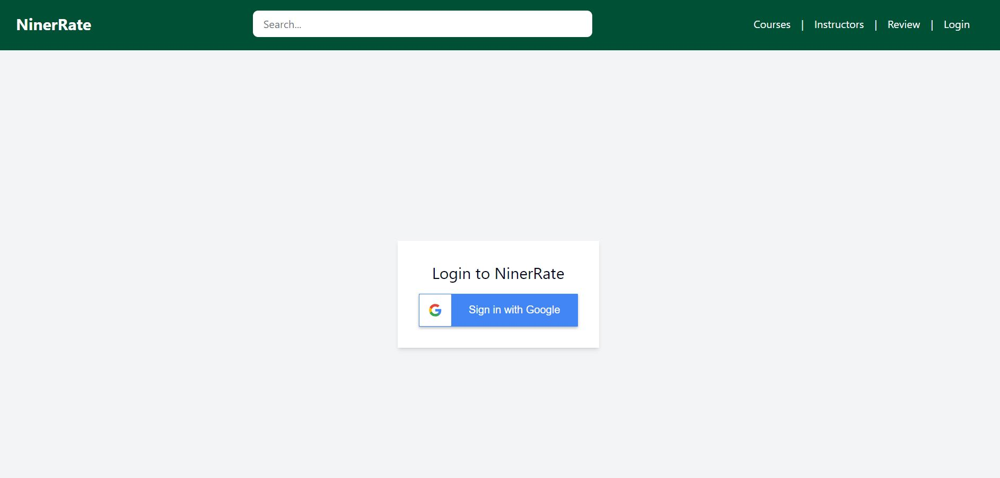
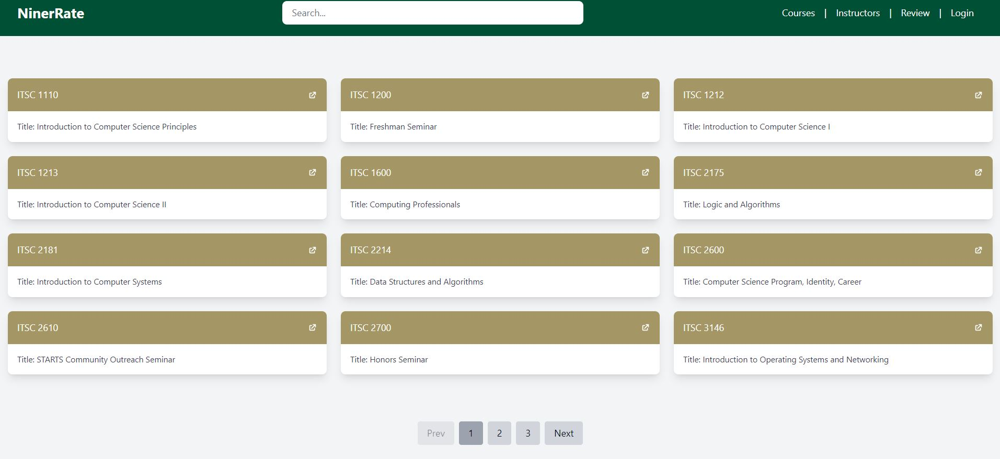
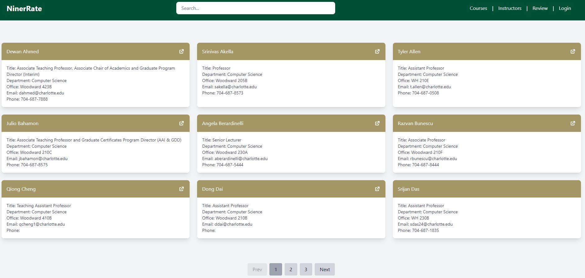

# Niner Rate

### Table of Contents:

- [Niner Rate](#niner-rate)
- [Project Overview](#project-overview)
- [Developed Using](#developed-using)
- [Deployment](#deployment)
- [Contributors](#contributors)

### Screenshots Overview:

| Login                                                                  | Home Page                                                                          | Courses                                                                      |
| ---------------------------------------------------------------------- | ---------------------------------------------------------------------------------- | ---------------------------------------------------------------------------- |
|  |  |  |

| Course Datails                                                                                 | Instructors                                                                              | Review                                                                    |
| ---------------------------------------------------------------------------------------------- | ---------------------------------------------------------------------------------------- | ------------------------------------------------------------------------- |
|  |  |  |

### Project Overview:

For our capstone project in ITSC 4155 Software Development Projects at UNC Charlotte, Oliver Briot, Kamaal Hassan, Willy Xiong, Txuj Yang, and Jai Vang collaborated to create Niner Rate.

Niner Rate is a fullstack web application designed as a sophisticated course and professor rating system specifically for UNC Charlotte students. The platform's primary goal is to empower students with insightful information by allowing them to rate courses and instructors based on various criteria. Students can provide detailed feedback on course materials, teaching methodologies, and class structures. By promoting transparency in teaching styles, the application equips students with essential knowledge to navigate their academic journey effectively and prepare for their professional careers. It addresses the common issue of students enrolling in courses without a clear understanding of what to expect, thereby helping them avoid potential regrets.

Through Niner Rate, students can create, modify, and delete their reviews as needed, ensuring that feedback remains relevant and up-to-date. Additionally, the platform offers a comprehensive overview of ratings for courses offered by the College of Computing and Informatics (CCI), providing valuable insights into the educational landscape within the CCI domain. Ultimately, Niner Rate serves as a valuable resource for students seeking to make informed decisions and optimize their learning experiences.

### Developed Using:

![Next.js]
![NextAuth.js]
![React]
![React DOM]
![React Radix UI]
![react-icons]
![React OAuth Google]
![react-google-button]
![TypeScript]
![JavaScript]
![Node.js]
![Tailwind CSS]
![tailwind-merge]
![tailwindcss-animate]
![PostCSS]
![CSS]
![MongoDB]
![Mongoose]
![Autoprefixer]

### Deployment:

The project has been deployed using [AWS Amplify](https://aws.amazon.com/amplify/) . You can access Niner Rate [here](https://main.d3f94s6am880j3.amplifyapp.com/).

### Contributors:

Oliver Briot, Kamaal Hassan, Willy Xiong, Txuj Yang, Jai Vang

<!-- MARKDOWN LINKS & IMAGES -->

[Next.js]: https://img.shields.io/badge/-Next.js-000000?style=for-the-badge&logo=next.js&logoColor=white
[NextAuth.js]: https://img.shields.io/badge/-NextAuth.js-000000?style=for-the-badge&logo=next.js&logoColor=white
[React]: https://img.shields.io/badge/-React-61DAFB?style=for-the-badge&logo=react&logoColor=white
[React DOM]: https://img.shields.io/badge/-React_DOM-61DAFB?style=for-the-badge&logo=react&logoColor=white
[React Radix UI]: https://img.shields.io/badge/-React_Radix_UI-61DAFB?style=for-the-badge&logo=react&logoColor=white
[React OAuth Google]: https://img.shields.io/badge/-React_OAuth_Google-61DAFB?style=for-the-badge&logo=google&logoColor=white
[react-google-button]: https://img.shields.io/badge/-react_google_button-61DAFB?style=for-the-badge&logo=google&logoColor=white
[react-icons]: https://img.shields.io/badge/-react_icons-61DAFB?style=for-the-badge&logo=react&logoColor=white
[TypeScript]: https://img.shields.io/badge/-TypeScript-3178C6?style=for-the-badge&logo=typescript&logoColor=white
[JavaScript]: https://img.shields.io/badge/-JavaScript-yellow?style=for-the-badge&logo=javascript
[Node.js]: https://img.shields.io/badge/node.js-339933?style=for-the-badge&logo=nodedotjs&logoColor=white
[Tailwind CSS]: https://img.shields.io/badge/-Tailwind_CSS-38B2AC?style=for-the-badge&logo=tailwind-css&logoColor=white
[tailwind-merge]: https://img.shields.io/badge/-tailwind_merge-38B2AC?style=for-the-badge&logo=tailwind-css&logoColor=white
[tailwindcss-animate]: https://img.shields.io/badge/-tailwindcss_animate-38B2AC?style=for-the-badge&logo=tailwind-css&logoColor=white
[PostCSS]: https://img.shields.io/badge/-PostCSS-DD3A0A?style=for-the-badge&logo=postcss&logoColor=white
[CSS]: https://img.shields.io/badge/-CSS-blue?style=for-the-badge&logo=css3
[MongoDB]: https://img.shields.io/badge/-MongoDB-880000?style=for-the-badge&logo=mongodb&logoColor=white
[Mongoose]: https://img.shields.io/badge/Mongoose-880000?style=for-the-badge&logo=mongoose&logoColor=FFFFFF
[Autoprefixer]: https://img.shields.io/badge/-Autoprefixer-DD3A0A?style=for-the-badge&logo=autoprefixer&logoColor=white
